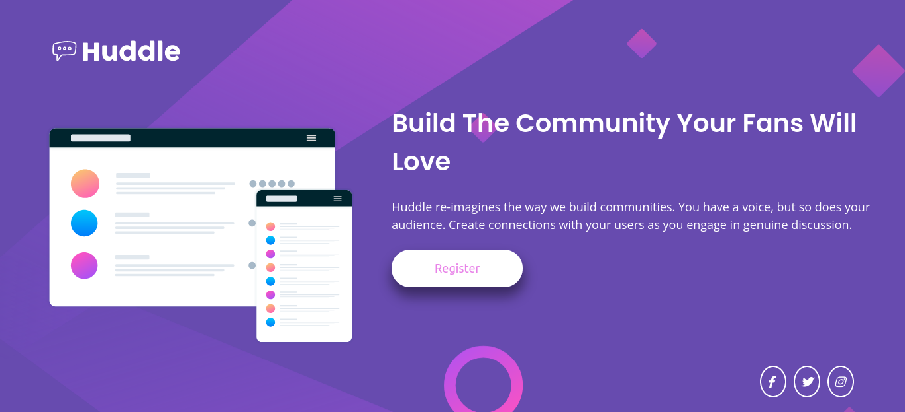

# Frontend Mentor - Huddle landing page with single introductory section solution

This is a solution to the [Huddle landing page with single introductory section challenge on Frontend Mentor](https://www.frontendmentor.io/challenges/huddle-landing-page-with-a-single-introductory-section-B_2Wvxgi0). Frontend Mentor challenges help you improve your coding skills by building realistic projects. 

## Table of contents

- [Overview](#overview)
  - [The challenge](#the-challenge)
  - [Screenshot](#screenshot)
  - [Links](#links)
- [My process](#my-process)
  - [Built with](#built-with)
  - [What I learned](#what-i-learned)
  - [Continued development](#continued-development)
  
**Note: Delete this note and update the table of contents based on what sections you keep.**

## Overview
  THis challenge is a coding a single huddle landing page. This is a newbie challenge that you will improve the way you use a layout. 
### The challenge

Users should be able to:

- View the optimal layout for the page depending on their device's screen size
- See hover states for all interactive elements on the page

### Screenshot




### Links

- Solution URL: [Add solution URL here](https://your-solution-url.com)
- Live Site URL: [Add live site URL here](https://your-live-site-url.com)

## My process


 My process first was build first a background and applying a flexbox its an easiest way to this single page than grid.
### Built with

- Semantic HTML5 markup
- CSS custom properties
- Flexbox

### What I learned

Have a time limit to a specific project just to add a pressure to yourself and I improve using

To see how you can add code snippets, see below:

```html
<h1>Some HTML code I'm proud of</h1>
```
```css
@media screen and (max-width: 768px){}
```
this was my first time applying media queries without using a tutorial or documentation.

### Continued development

Will need to improve a Responsive Design


